# Hello Fractals
Check samples with Hello_something.py for sample code on how to do stuff
* The code did a functional approach (no classes) ... dont add classes or I might refactor lmao

**Fractals (the images are links to sample code)**

[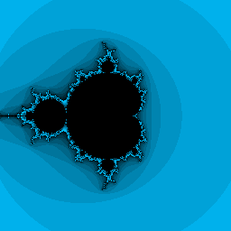](../samples/fractals/Hello_Mandelbrot_Set.py)

[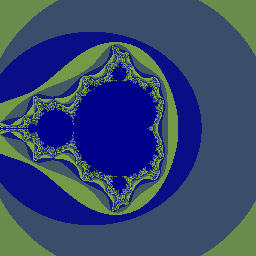](../samples/fractals/Hello_Mandelbrot_Set_dichromatic.py)

[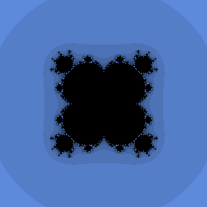](../samples/fractals/Hello_Multibrot_Set.py)

[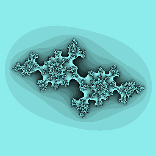](../samples/fractals/Hello_Julia_Set.py)

[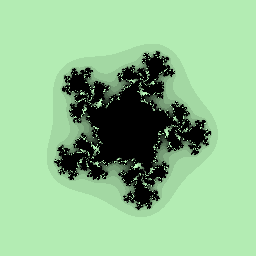](../samples/fractals/Hello_Multijulia_Set.py)

[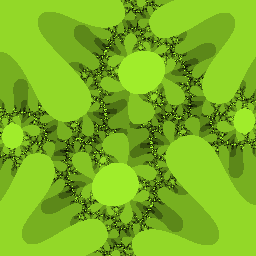](../samples/fractals/Hello_SpiralJulia_Set.py)

[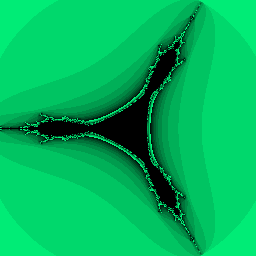](../samples/fractals/Hello_Tricorn_Set.py)

[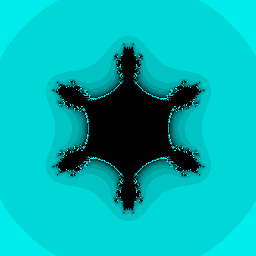](../samples/fractals/Hello_Multicorn_Set.py)

[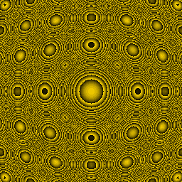](../samples/fractals/Hello_Multicircle.py)

[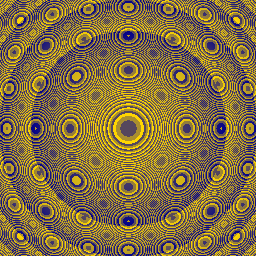](../samples/fractals/Hello_Multicircle_dichromatic.py)

[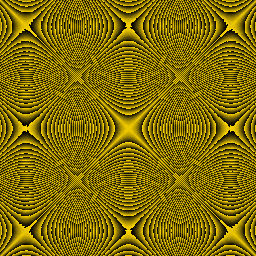](../samples/fractals/Hello_Multihyperbola.py)

[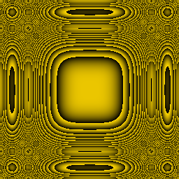](../samples/fractals/Hello_Multisuperellipse.py)

[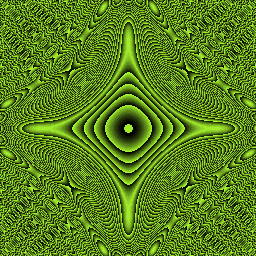](../samples/fractals/Hello_Astroidfractal.py)

[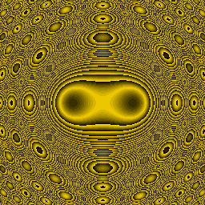](../samples/fractals/Hello_Lemniscatefractal.py)

[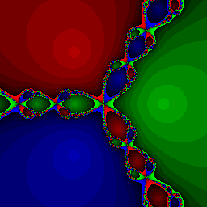](../samples/fractals/Hello_Newtons_fractal.py)

[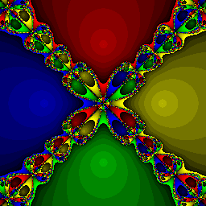](../samples/fractals/Hello_Newtons_fractal4.py)

[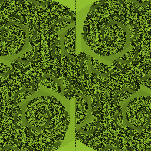](../samples/fractals/Hello_BarnsleyTree.py)

[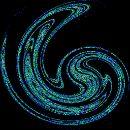](../samples/fractals/Hello_Ikedaattractor.py)

[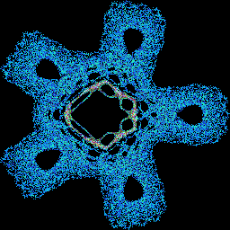](../samples/fractals/Hello_Gumowski-Mira_attractor_1.py)

[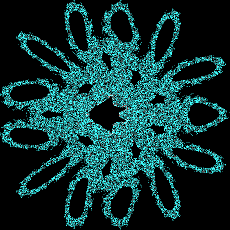](../samples/fractals/Hello_Gumowski-Mira_attractor.py)

[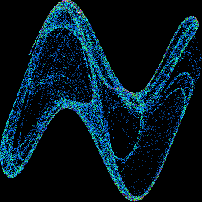](../samples/fractals/Hello_nattractor.py)

[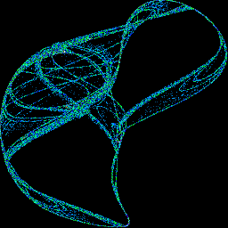](../samples/fractals/Hello_PeterdeJongAttractor.py)

[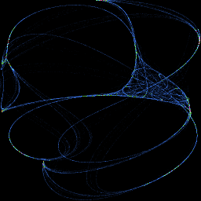](../samples/fractals/Hello_CliffordAttractor.py)

[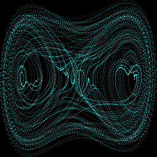](../samples/fractals/Hello_DuffingAttractor.py)

[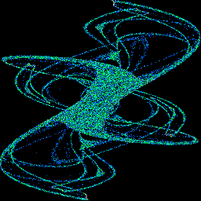](../samples/fractals/Hello_FractalDreamAttractor.py)

[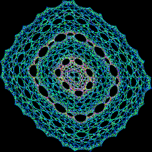](../samples/fractals/Hello_HopalongAttractor.py)

[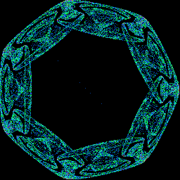](../samples/fractals/Hello_Symmetric_Icon_Attractor.py)

[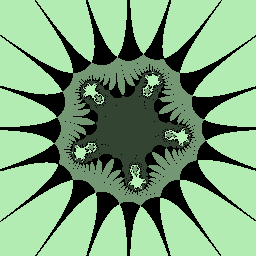](../samples/fractals/Hello_MultiBiomorphfractal.py)

[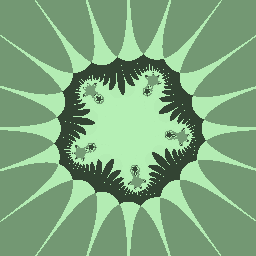](../Hello_PaletteShift.py)

[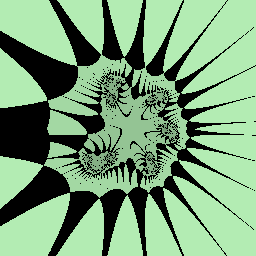](../samples/fractals/Hello_MultiBiomorphphasevariantfractal.py)

[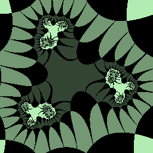](../samples/fractals/Hello_MultiCosBiomorphfractal.py)

[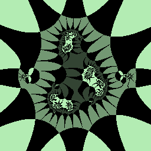](../samples/fractals/Hello_MultiTanBiomorphfractal.py)

[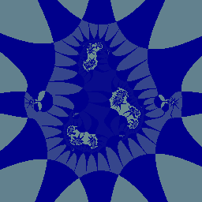](../samples/fractals/Hello_MultiTanBiomorphfractal_dichromatic.py)

[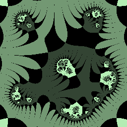](../samples/fractals/Hello_MultiSinhBiomorphfractal.py)

[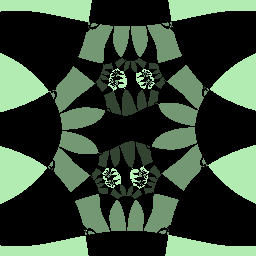](../samples/fractals/Hello_MultiCoshBiomorphfractal.py)

[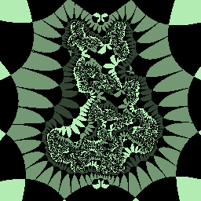](../samples/fractals/Hello_MultiTanhBiomorphfractal.py)

[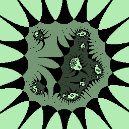](../samples/fractals/Hello_MultiexpBiomorphfractal.py)

[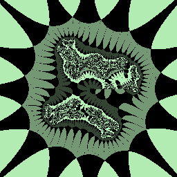](../samples/fractals/Hello_Multi2ndtetrationBiomorphfractal.py)

[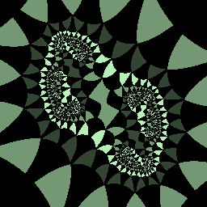](../samples/fractals/Hello_MultizconjugateBiomorphfractal.py)

[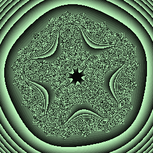](../samples/fractals/Hello_MultiBiomorphvariantfractal.py)

[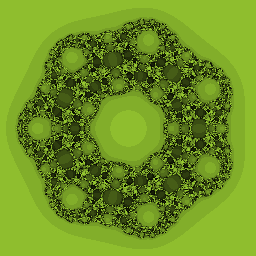](../samples/fractals/Hello_ngonfractal.py)

[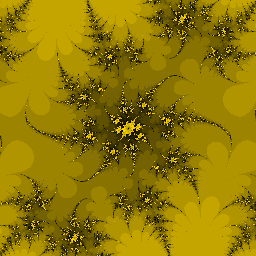](../samples/fractals/Hello_SinJulia_Set.py)

[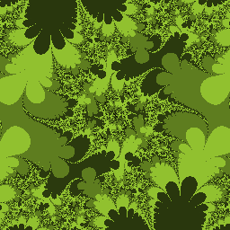](../samples/fractals/Hello_SinJulia_Set_4bit.py)

[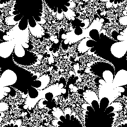](../samples/fractals/Hello_SinJulia_Set_1bit.py)

[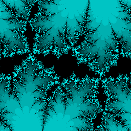](../samples/fractals/Hello_CosJulia_Set.py)

[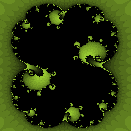](../samples/fractals/Hello_MarekDragon.py)

[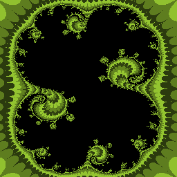](../samples/fractals/Hello_MarekDragon_4bit.py)

[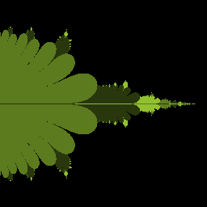](../samples/fractals/Hello_Tetration_Fractal.py)

[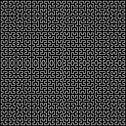](../samples/fractals/Hello_HilbertCurve.py)

[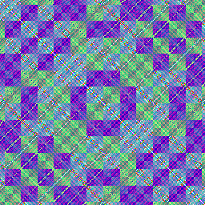](../samples/fractals/Hello_Xorfractal.py)

* 
* 
* 
* 
* 
* 
* 
* 
