[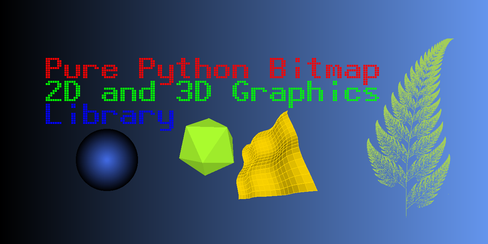](../Hello_APP_Github_ID.py)

# Hello Graphics
Check samples with Hello_something.py for sample code on how to do stuff
* The code did a functional approach (no classes) ... dont add classes or I might refactor lmao

## 

## 

## 

# References

**Functional Progamming in Python:** https://machinelearningmastery.com/functional-programming-in-python/

**Details on the windows bitmap format:** https://docs.microsoft.com/en-us/windows/win32/gdi/bitmap-storage

**Ground up 2D graphics:**
* https://en.wikipedia.org/wiki/Bresenham%27s_line_algorithm
* https://en.wikipedia.org/wiki/Midpoint_circle_algorithm
* https://en.wikipedia.org/wiki/B-spline
* https://en.wikipedia.org/wiki/B%C3%A9zier_curve
* see: 
* 

**3D entities to onscreen 2D:** https://www.evl.uic.edu/luc/488/slides/class7.pdf
* 

**Math in Computer Graphics:** https://faculty.cc.gatech.edu/~turk/math_gr.html
* 
* fractals http://paulbourke.net/fractals/
* 2D Strange attractors https://softologyblog.wordpress.com/2017/03/04/2d-strange-attractors/
* parametric curves https://mathworld.wolfram.com/topics/Curves.html
* moar curves https://mathcurve.com

**Colors**
* X11 color source: https://cgit.freedesktop.org/xorg/xserver/tree/os/oscolor.c
* XKCD color source:  https://xkcd.com/color/rgb/

If there is demand for it I could in theory write a book based on this project lmao.

**Books:**
* Roger T. Stevens. Graphics Programming in C (1993). 1st Indian Edition, M & T Publishing Inc
* Bernard Kolman. Elementary Linear Algebra (1991). 5th Edition, Macmillan Publishing Company
* Gerald L. Bradley, Karl J. Smith. Multivariable Calculus (1999). 2nd Edition, Prentice Hall

# Fully commented sample code list below

**Named colors**
* 
* 
* 

**Full Gradient Background**
* 
* 
* 
* 
* 
* 

**Line**
* 
* 
* 
* 

**Rectangle (images are links to sample code)**

[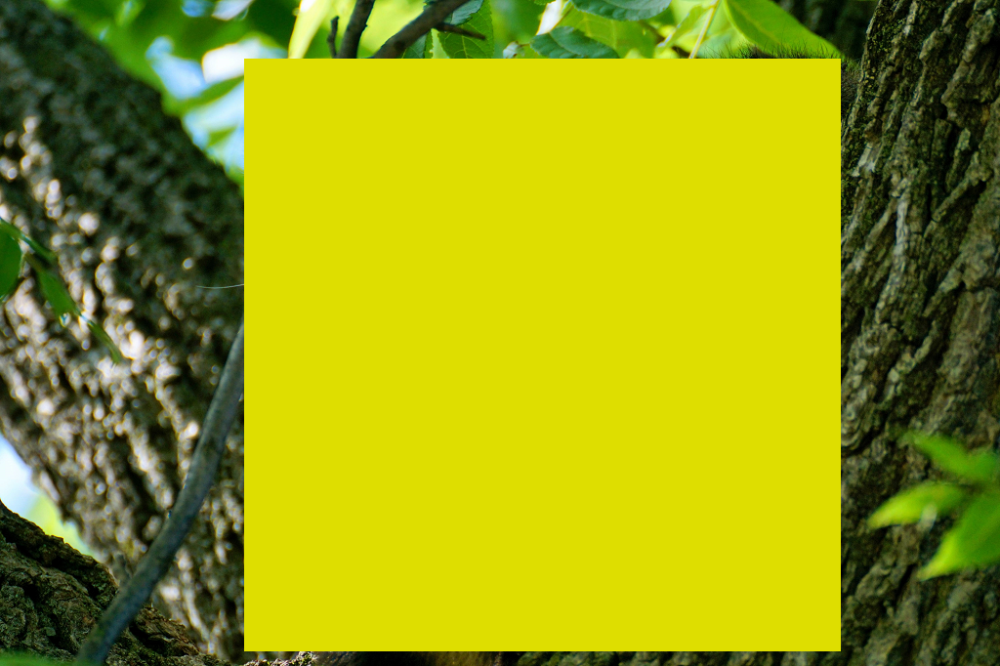](../samples/primitives2d/Hello_FilledRectangle.py)

[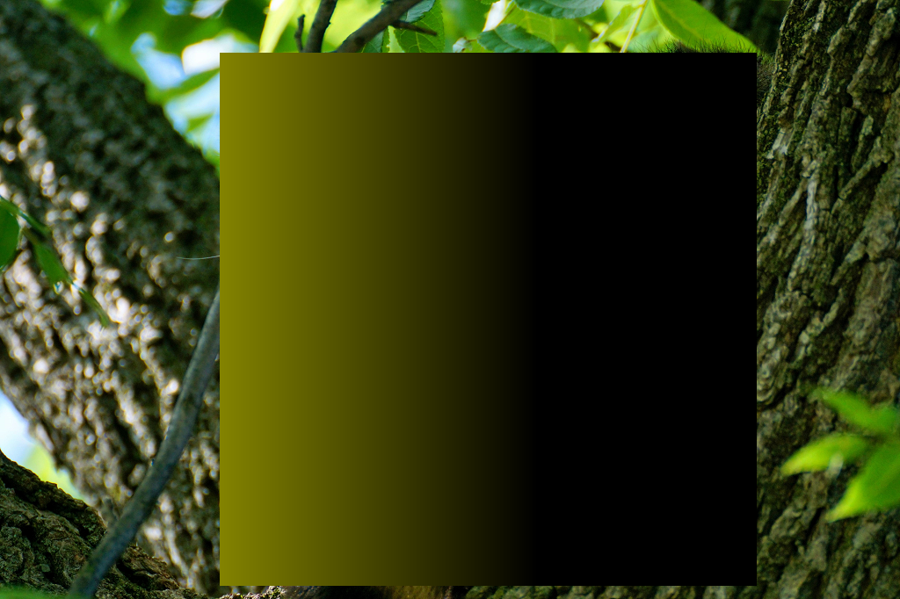](../Hello_FilledvertGradRect.py)

[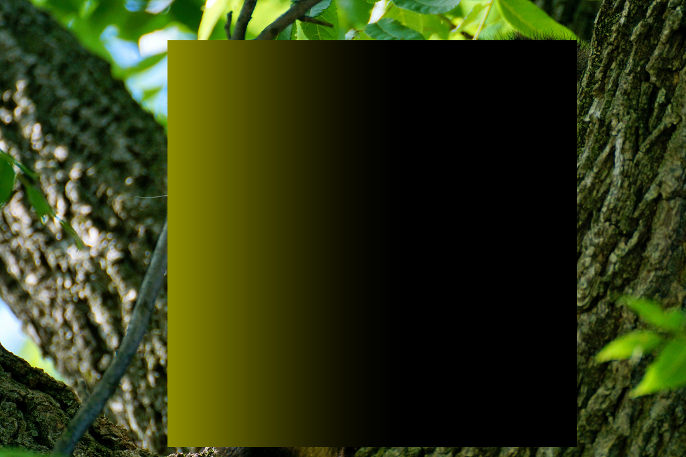](../Hello_FilledvertGradRectsmoothstep.py)

[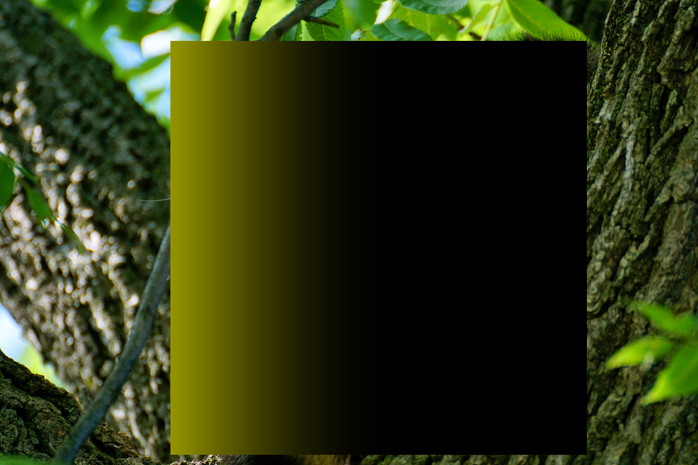](../Hello_FilledvertGradRectsmootherstep.py)

[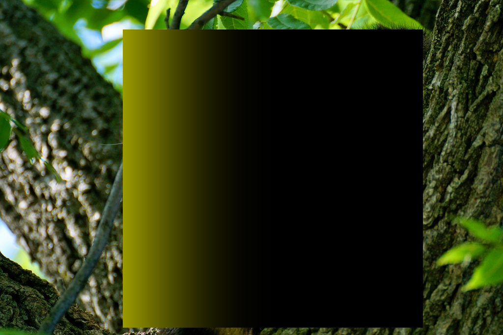](../Hello_FilledvertGradRectsmootheststep.py)

[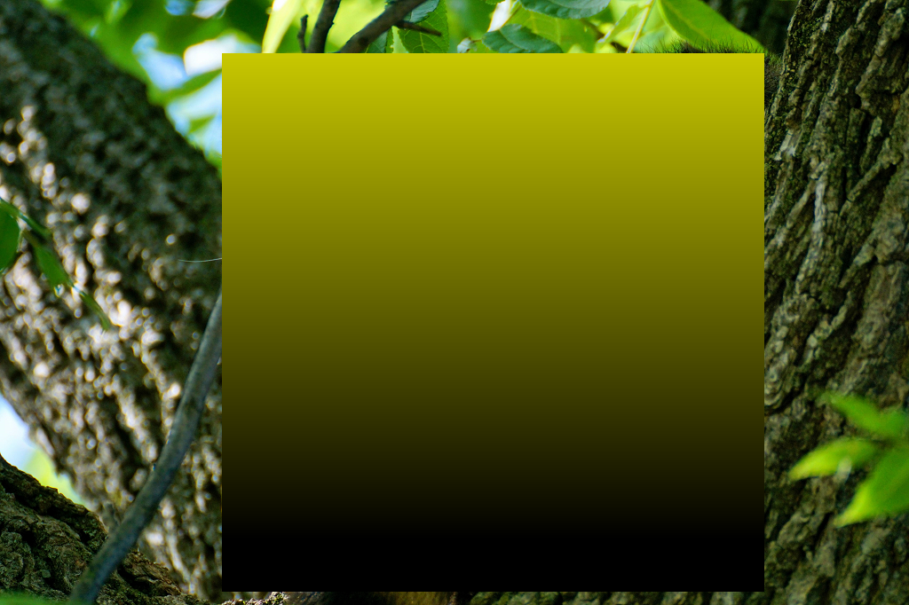](../Hello_FilledhoriGradRect.py)

[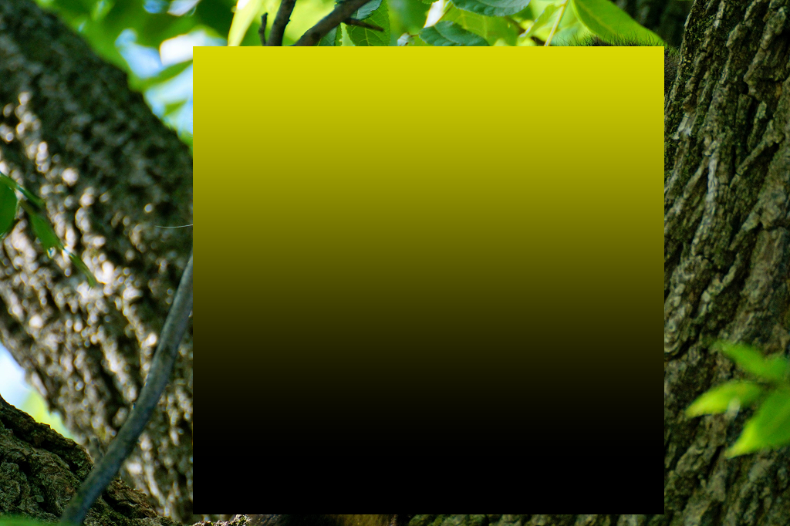](../Hello_FilledhoriGradRectsmoothstep.py)

[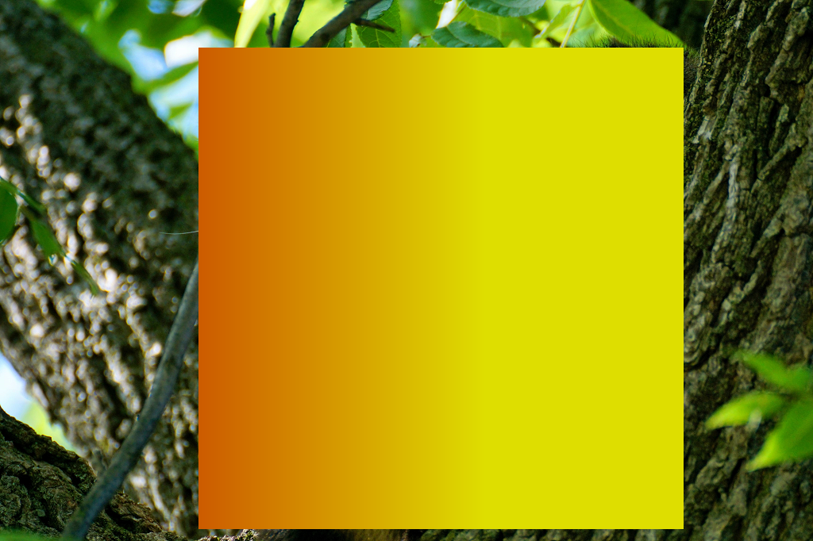](../Hello_FilleddichromaticvertGradRect.py)

[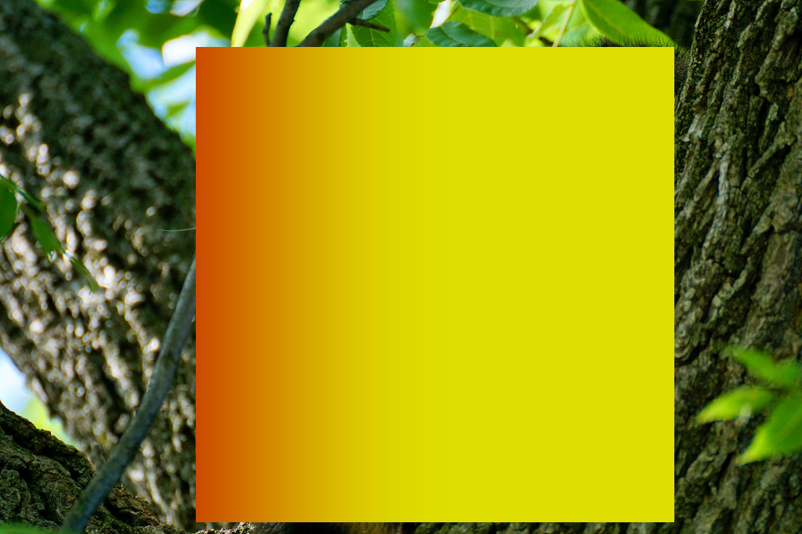](../Hello_FilleddichromaticvertGradRectsmootherstep.py)

[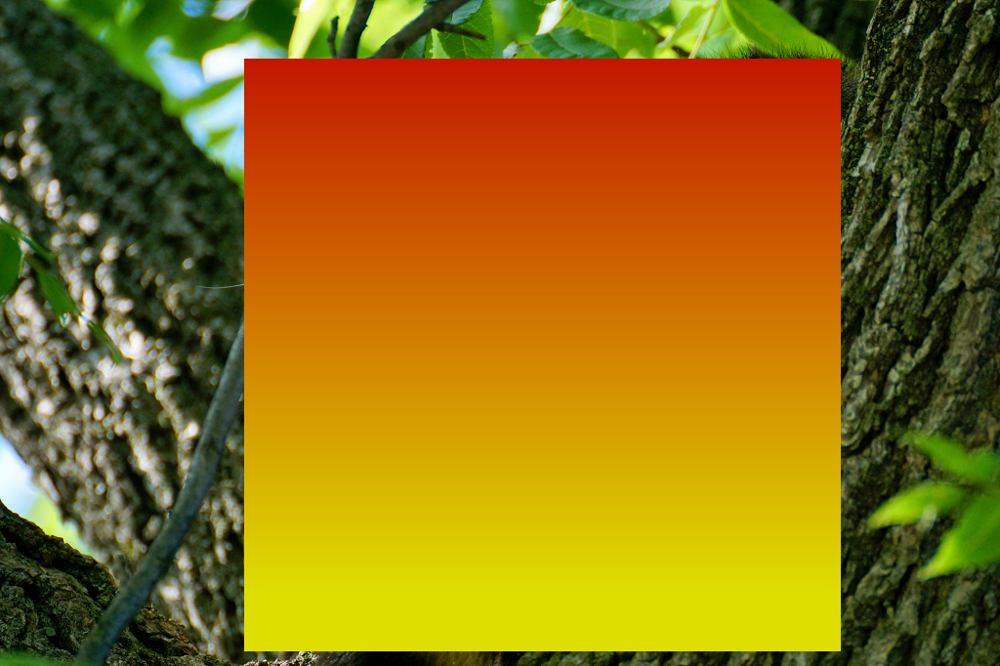](../Hello_FilleddichromatichoriGradRect.py)

[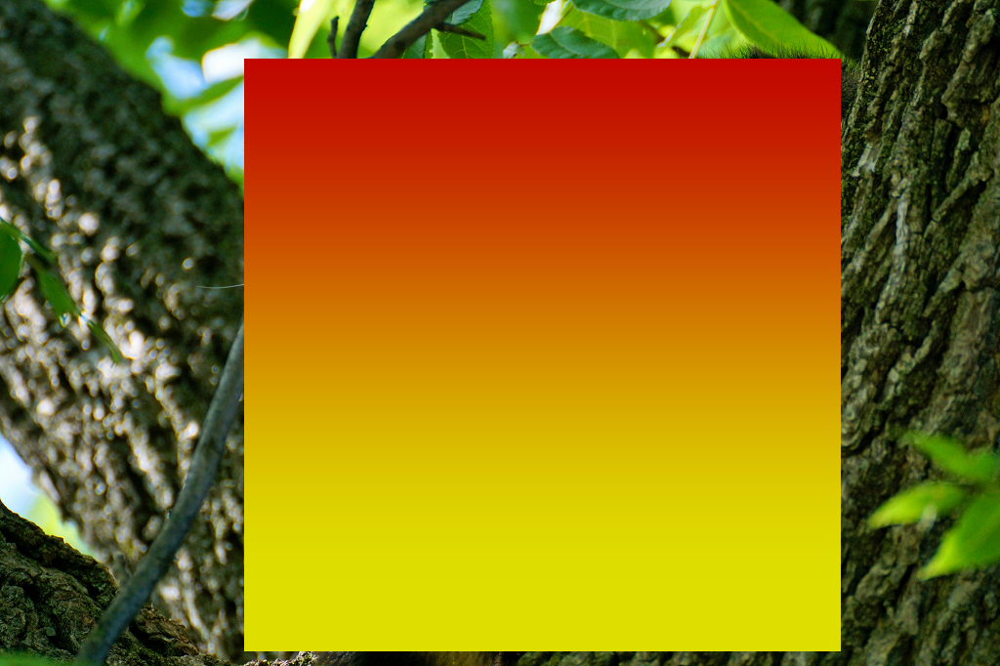](../Hello_FilleddichromatichoriGradRectsmoothstep.py)

[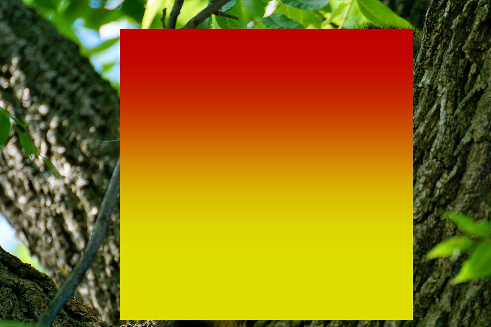](../Hello_FilleddichromatichoriGradRectsmootheststep.py)

**Regular Polygons**

**Circle (images are links to sample code)**

**Ellipse**
* 
* 
* 
* 

**Curves and Spirals**
* 
* 
* 
* 
* 
* 

**3D and 3D shading effects (Images are links to sample code)**

[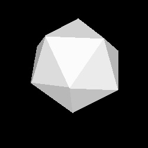](../Hello_Icosahedron.py)

* 
* 
* 
* 
* 
* 
* 
* 
* 
* 
* 
* 
* 

**Parametric Curve Equations (images are links to sample code)**

[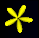](/Hello_Flower.py)

* 
* 
* 
* 
* 
* 
* 
* 
* 
* 

**Spirographs**
* 
* 
* 
* 

**Graphs**
* 
