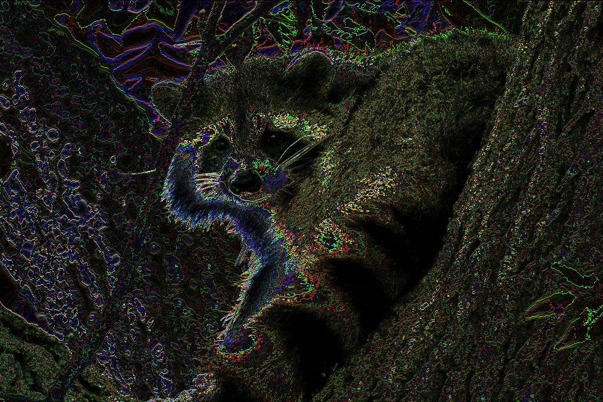
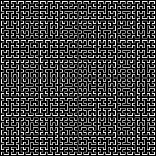

# Hello Graphics
Check samples with Hello_something.py for sample code on how to do stuff
* The code did a functional approach (no classes) ... dont add classes or I might refactor lmao

## 

## 

## 

# References

**The Basics:** https://github.com/TechnoTanuki/Python_BMP#readme

**Functional Progamming in Python:** https://machinelearningmastery.com/functional-programming-in-python/

**Details on the windows bitmap format:** https://docs.microsoft.com/en-us/windows/win32/gdi/bitmap-storage

**Ground up 2D graphics:**
* https://en.wikipedia.org/wiki/Bresenham%27s_line_algorithm 
* https://en.wikipedia.org/wiki/Midpoint_circle_algorithm
* https://en.wikipedia.org/wiki/B-spline
* https://en.wikipedia.org/wiki/B%C3%A9zier_curve
* see: 
* 

**3D entities to onscreen 2D:** https://www.evl.uic.edu/luc/488/slides/class7.pdf
* 

**Math in Computer Graphics:** https://faculty.cc.gatech.edu/~turk/math_gr.html 
* 
* parametric curves https://mathworld.wolfram.com/topics/Curves.html
* moar curves https://mathcurve.com

**Colors**
* X11 color source: https://cgit.freedesktop.org/xorg/xserver/tree/os/oscolor.c
* XKCD color source:  https://xkcd.com/color/rgb/
 
If there is demand for it I could in theory write a book based on this project lmao.

**Books:**
* Roger T. Stevens. Graphics Programming in C (1993). 1st Indian Edition, M & T Publishing Inc
* Bernard Kolman. Elementary Linear Algebra (1991). 5th Edition, Macmillan Publishing Company
* Gerald L. Bradley, Karl J. Smith. Multivariable Calculus (1999). 2nd Edition, Prentice Hall

# Fully commented sample code list below

**Text and Fonts**
* 
* 
* 
* 
* 
* 
* 
* 
* 

**Named colors**
* https://github.com/TechnoTanuki/Python_BMP/blob/main/Hello_ColorNames.py
* https://github.com/TechnoTanuki/Python_BMP/blob/main/Hello_X11ColorNames.py
* https://github.com/TechnoTanuki/Python_BMP/blob/main/Hello_XKCDColorNames.py

**Full Gradient Background**
* https://github.com/TechnoTanuki/Python_BMP/blob/main/Hello_Linear_Gradient.py
* https://github.com/TechnoTanuki/Python_BMP/blob/main/Hello_Circular_Gradient.py
* https://github.com/TechnoTanuki/Python_BMP/blob/main/Hello_Radial_Gradients.py
* https://github.com/TechnoTanuki/Python_BMP/blob/main/Hello_NonLinearRadial_Gradients.py
* https://github.com/TechnoTanuki/Python_BMP/blob/main/Hello_RadialMultichannel_Gradients.py
* https://github.com/TechnoTanuki/Python_BMP/blob/main/Hello_NonLinearRadialMultichannel_Gradients.py

**Copy/Paste and Save Selection**
* https://github.com/TechnoTanuki/Python_BMP/blob/main/Hello_Save_Selection.py
* https://github.com/TechnoTanuki/Python_BMP/blob/main/Hello_Copy_Paste_Earth.py
* https://github.com/TechnoTanuki/Python_BMP/blob/main/Hello_Crop_Earth.py

**Line**
* https://github.com/TechnoTanuki/Python_BMP/blob/main/Hello_Lines.py
* https://github.com/TechnoTanuki/Python_BMP/blob/main/Hello_Vector.py
* https://github.com/TechnoTanuki/Python_BMP/blob/main/Hello_Thick_Round_Line.py
* https://github.com/TechnoTanuki/Python_BMP/blob/main/Hello_Thick_Round_Gradient_Line.py

**Rectangle**
* https://github.com/TechnoTanuki/Python_BMP/blob/main/Hello_Rectangle.py
* https://github.com/TechnoTanuki/Python_BMP/blob/main/Hello_FilledRectangle.py
* https://github.com/TechnoTanuki/Python_BMP/blob/main/Hello_FilledGradRect.py

**Regular Polygons**
* https://github.com/TechnoTanuki/Python_BMP/blob/main/Hello_Regular_Polygon.py
* https://github.com/TechnoTanuki/Python_BMP/blob/main/Hello_Thick_Regular_Polygon.py
* https://github.com/TechnoTanuki/Python_BMP/blob/main/Hello_Gradient_Thick_Regular_Polygon.py

**Circle** 
* https://github.com/TechnoTanuki/Python_BMP/blob/main/Hello_Circles.py
* https://github.com/TechnoTanuki/Python_BMP/blob/main/Hello_FilledCircle.py
* https://github.com/TechnoTanuki/Python_BMP/blob/main/Hello_Thick_Circle.py
* https://github.com/TechnoTanuki/Python_BMP/blob/main/Hello_Thick_Gradient_Circle.py

**Ellipse**
* https://github.com/TechnoTanuki/Python_BMP/blob/main/Hello_Ellipse.py
* https://github.com/TechnoTanuki/Python_BMP/blob/main/Hello_FilledEllipse.py
* https://github.com/TechnoTanuki/Python_BMP/blob/main/Hello_Elliptical_Gradient.py
* https://github.com/TechnoTanuki/Python_BMP/blob/main/Hello_Thick_Gradient_Ellipse_Rotated.py

**Curves and Spirals**
* https://github.com/TechnoTanuki/Python_BMP/blob/main/Hello_BezierCurve.py
* https://github.com/TechnoTanuki/Python_BMP/blob/main/Hello_Bspline.py
* https://github.com/TechnoTanuki/Python_BMP/blob/main/Hello_InvoluteofaCircle.py
* https://github.com/TechnoTanuki/Python_BMP/blob/main/Hello_CornuSpiral.py
* https://github.com/TechnoTanuki/Python_BMP/blob/main/Hello_SquareSpiral.py
* https://github.com/TechnoTanuki/Python_BMP/blob/main/Hello_Thick_Exponential_Spiral_Gradient.py

**3D and 3D shading effects**
* https://github.com/TechnoTanuki/Python_BMP/blob/main/Hello_3D.py
* https://github.com/TechnoTanuki/Python_BMP/blob/main/Hello_3D_surfaceplot.py
* https://github.com/TechnoTanuki/Python_BMP/blob/main/Hello_Sphere.py
* https://github.com/TechnoTanuki/Python_BMP/blob/main/Hello_Orb.py
* https://github.com/TechnoTanuki/Python_BMP/blob/main/Hello_Benzene.py
* https://github.com/TechnoTanuki/Python_BMP/blob/main/Hello_Globe.py
* https://github.com/TechnoTanuki/Python_BMP/blob/main/Hello_DiscoBall.py
* https://github.com/TechnoTanuki/Python_BMP/blob/main/Hello_Coin.py
* https://github.com/TechnoTanuki/Python_BMP/blob/main/Hello_Cone.py
* https://github.com/TechnoTanuki/Python_BMP/blob/main/Hello_Tetrahedron.py
* https://github.com/TechnoTanuki/Python_BMP/blob/main/Hello_Cube.py
* https://github.com/TechnoTanuki/Python_BMP/blob/main/Hello_Octahedron.py
* https://github.com/TechnoTanuki/Python_BMP/blob/main/Hello_Decahedron.py
* https://github.com/TechnoTanuki/Python_BMP/blob/main/Hello_Icosahedron.py
* https://github.com/TechnoTanuki/Python_BMP/blob/main/Hello_Icosahedron_Outline.py

**Downscale or Upscale Color Encoding in Bits**
* https://github.com/TechnoTanuki/Python_BMP/blob/main/Hello_8bitBMP_Downscale.py
* https://github.com/TechnoTanuki/Python_BMP/blob/main/Hello_4bitBMP_Downscale.py
* https://github.com/TechnoTanuki/Python_BMP/blob/main/Hello_1bitBMP_Downscale.py

**Resize**
* 
* 

**Image and Color Processing (the images are links to sample code)**

**Flip/Rotate (the images are links to sample code)**

**Mirror (the images are links to sample code)**

**Fractals (the images are links to sample code)**

* https://github.com/TechnoTanuki/Python_BMP/blob/main/Hello_Newtons_fractal4_1.py
* https://github.com/TechnoTanuki/Python_BMP/blob/main/Hello_Newtons_fractal5.py
* https://github.com/TechnoTanuki/Python_BMP/blob/main/Hello_Newtons_fractal5_3.py
* https://github.com/TechnoTanuki/Python_BMP/blob/main/Hello_Newtons_fractal6.py
* https://github.com/TechnoTanuki/Python_BMP/blob/main/Hello_Newtons_fractal6_3.py
* https://github.com/TechnoTanuki/Python_BMP/blob/main/Hello_Fern.py
* https://github.com/TechnoTanuki/Python_BMP/blob/main/Hello_ThickGradHilbertCurve.py
* https://github.com/TechnoTanuki/Python_BMP/blob/main/Hello_KochCurve.py
* https://github.com/TechnoTanuki/Python_BMP/blob/main/Hello_CatPaws.py

**Parametric Curve Equations**
* https://github.com/TechnoTanuki/Python_BMP/blob/main/Hello_Cardioid.py
* https://github.com/TechnoTanuki/Python_BMP/blob/main/Hello_Epicycloid.py
* https://github.com/TechnoTanuki/Python_BMP/blob/main/Hello_Flower.py
* https://github.com/TechnoTanuki/Python_BMP/blob/main/Hello_Octopetala.py
* https://github.com/TechnoTanuki/Python_BMP/blob/main/Hello_GearCurve.py
* https://github.com/TechnoTanuki/Python_BMP/blob/main/Hello_HeartCurve.py
* https://github.com/TechnoTanuki/Python_BMP/blob/main/Hello_EggCurve.py
* https://github.com/TechnoTanuki/Python_BMP/blob/main/Hello_LissajousCurve.py
* https://github.com/TechnoTanuki/Python_BMP/blob/main/Hello_Hypotrochoid.py
* https://github.com/TechnoTanuki/Python_BMP/blob/main/Hello_Superellipse.py
* https://github.com/TechnoTanuki/Python_BMP/blob/main/Hello_Squircles.py

**Spirographs**
* https://github.com/TechnoTanuki/Python_BMP/blob/main/Hello_Spirograph.py
* https://github.com/TechnoTanuki/Python_BMP/blob/main/Hello_Spirograph_1.py
* https://github.com/TechnoTanuki/Python_BMP/blob/main/Hello_Spirograph_2.py
* https://github.com/TechnoTanuki/Python_BMP/blob/main/Hello_Spirograph_Record.py

**Graphs**
* https://github.com/TechnoTanuki/Python_BMP/blob/main/Hello_XYScatterplot.py
