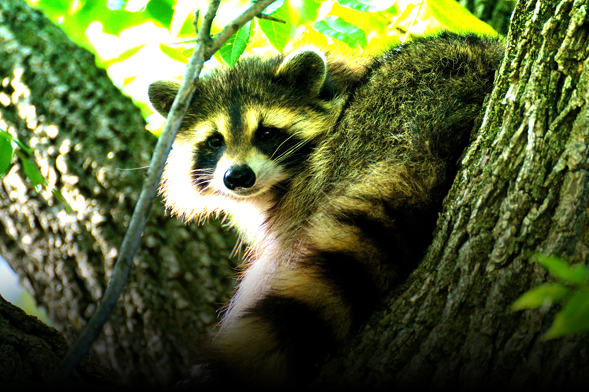
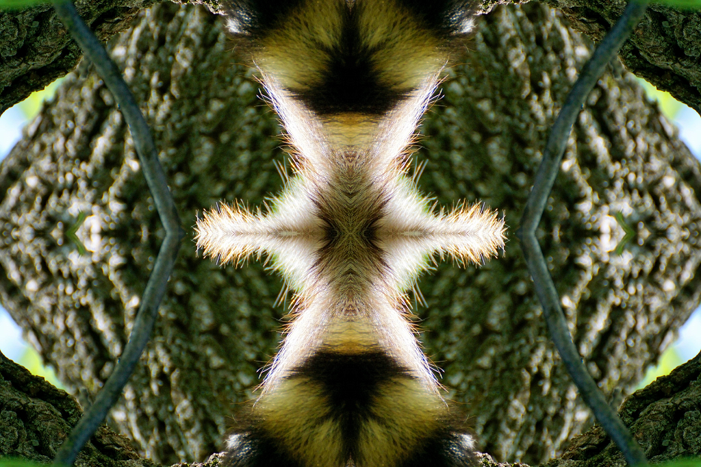
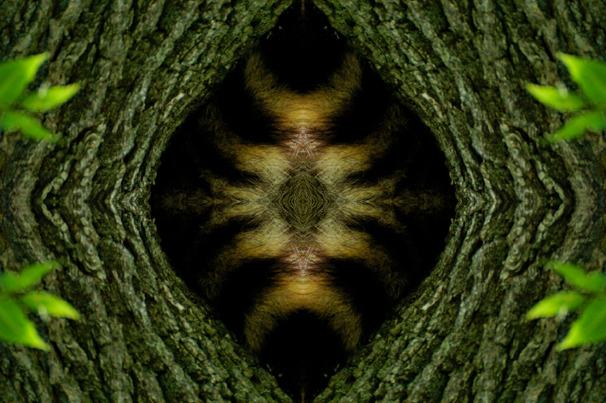

# Hello Image Processing
Check samples with Hello_something.py for sample code on how to do stuff
* The code did a functional approach (no classes) ... dont add classes or I might refactor lmao

**Downscale or Upscale Color Encoding in Bits**
* 
* 
* 

**Resize**
* 
* 

**Image and Color Processing (the images are links to sample code)**

**Flip/Rotate (the images are links to sample code)**

**Mirror (the images are links to sample code)**

