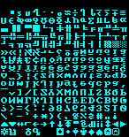
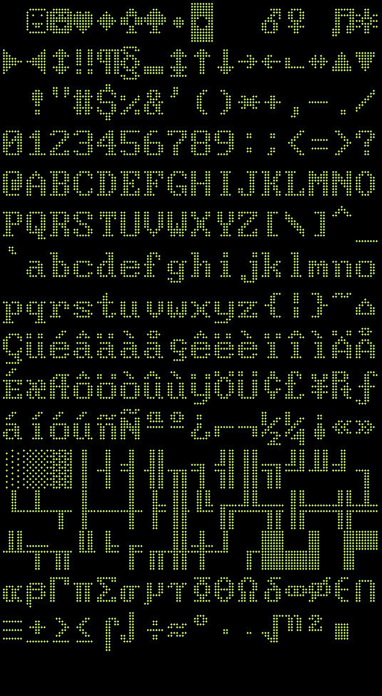

# Hello Texts
Check samples with Hello_something.py for sample code on how to do stuff
* The code did a functional approach (no classes) ... dont add classes or I might refactor lmao

**Text and Fonts (images are links to sample code)**

